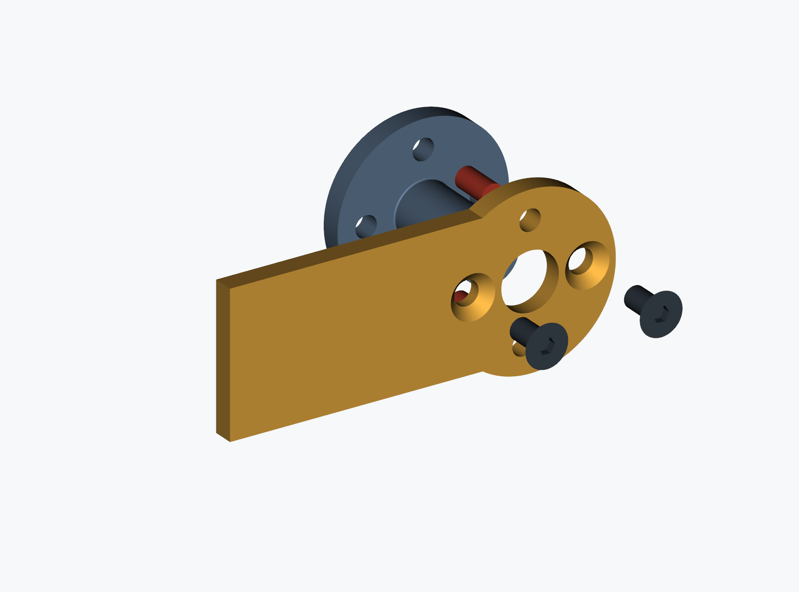
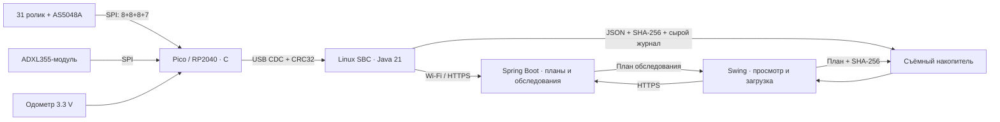
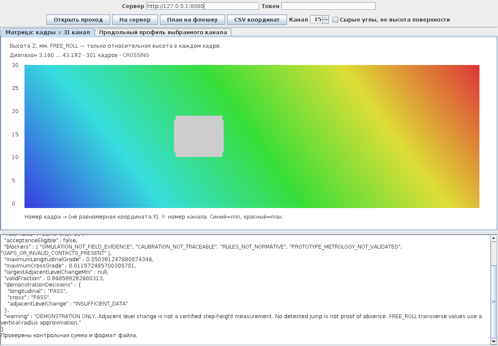

# Qulay / Кулай

**QL-01.R1 + C1 — открытый инженерный прототип контактного профилометра доступной среды.** Тележка с 31 независимым роликом измеряет переход «дорога — бордюрный съезд — тротуар». Результат — исходные отсчёты, геометрия, пропуски и воспроизводимый отчёт, а не неподтверждённое заключение о приёмке.

Рабочая ветка: `feature/qulay-prototype-20261002`. Исходная история сохранена; `main` не заменяется. **Это ещё не производственный комплект всей тележки и не метрологически утверждённый прибор.**

## Актуальное соединение рычага с валом: C1

Предупреждение в документах R1 о неразработанном соединении рычага с валом относится к исторической конструкции. Теперь для этого узла разработан **C1: цельный фланцевый вал, два установочных штифта Ø3 и два прижимных винта M3**. Передача момента не опирается на трение стянутых торцов. Детали, посадки, сборка и критерии стендового контроля описаны в отдельном комплекте; физические испытания ещё не выполнены.

**[PDF C1: пояснение и размерные чертежи](mechanical/coupling_c1/generated/Qulay_C1_Lever_Shaft_Coupling.pdf)** · **[Весь комплект STEP/DXF и отчётов](mechanical/coupling_c1/generated)** · **[Описание конструкции и изготовления](mechanical/coupling_c1/README.md)** · **[Область изменения C1](docs/REVISION_C1.md)**



В каталоге C1 находятся обычные файлы, а не архив вместо проекта: отдельные STEP деталей и соединения, три STEP-сборки тележки с установленным C1, DXF рычага и карты отверстий фланца, PDF, BOM, расчёт, проверка пересечений и контрольные суммы. Старые модели R1 сохранены для сравнения; они не заменяют сборки с C1.

## Что открывать

| Часть | Содержимое |
|---|---|
| [C1: соединение рычага с валом](mechanical/coupling_c1) | Цельный фланцевый вал, штифты и винты; исходники, детали, посадки и порядок сборки |
| [C1: готовые файлы](mechanical/coupling_c1/generated) | PDF с тремя листами A3, STEP деталей и трёх положений тележки, DXF, BOM и проверки |
| [Руководство по механике и монтажу R1](docs/manual) | Историческая базовая инструкция; для соединения рычаг–вал применять дополнение C1 |
| [Один ролик, tilt и AS5048A](docs/channel) | Принцип измерения, магнит, SPI и преобразование угла; статус соединения уточнён ссылкой на C1 |
| [CAD ревизии R1](mechanical/generated-r1) | Три исторические STEP-сборки, реальные CAD-виды и разрез, DXF кронштейна, реестры, отчёты пересечений |
| [PDF узла и сборок R1](mechanical/generated-r1/QL01-R1-review.pdf) | Крупные изображения исходной ревизии; соединение рычаг–вал заменено в C1 |
| [Первоначальный комплект](mechanical/generated) | Исходные модели, альбом A3, DXF рычага и реестры; не удалены |
| [Плата датчика](electronics/generated/encoder) | KiCad-проект, схема PDF, PCB/SVG, Gerber/Excellon прототипа, ERC/DRC и netlist |
| [Плата сбора с Pico](electronics/generated/carrier) | KiCad-проект R1 для подключения четырёх цепочек датчиков, ADXL355-модуля, одометра и USB |
| [Прошивка](firmware) | RP2040/Pico SDK, сборка UF2/ELF в Actions; C, не Java |
| [Java/Maven](software) | core, сервер Spring Boot, desktop Swing, агент SBC и геометрический симулятор |
| [Подтверждение тестов R1](generated/verification/summary.json) | 52 модульных теста и 12 end-to-end проверок на момент R1; commit и run ID внутри отчёта |
| [Изменения и ограничения R1](docs/REVISION_R1.md) | История исправлений и исходные ограничения; дополнение по соединению — C1 |

Редактируемый CAD-источник C1: [mechanical/coupling_c1/build.py](mechanical/coupling_c1/build.py), использующий [mechanical/revision_b.py](mechanical/revision_b.py) и исходный [build.py](mechanical/build.py). Это CadQuery/OpenCascade + STEP, не вымышленный проект, якобы сохранённый из SolidWorks.

## Архитектура базового программно-измерительного контура R1



Основной компьютер — Raspberry Pi/совместимый Linux SBC; измерительный опрос вынесен в Pico. Специальное мобильное приложение не требуется: телефон может предоставлять Wi-Fi-точку доступа. Полностью автономный мобильный интернет предполагает отдельный USB LTE-модем и настройку Linux; собственная ВЧ-плата и проверенный LTE-комплект в R1 не заявлены. Выпуск C1 изменяет механическое соединение, а не этот контур связи.

## Что измеряется

X — направление прохода, Y — положение канала поперёк тележки, Z — высота. Угол рычага — исходное измерение, **не ось Y и не готовый уклон поверхности**. При пересчёте изменяются и X, и Z точки контакта; наклоны рамы также учитываются.

`CROSSING`: движение поперёк бордюра. Для достоверного продольного профиля нужна независимая высотная база. `ALONG_CURB`: часть роликов на дороге, часть на тротуаре; анализируется разность площадок и смещение контактов по X. `FREE_ROLL` не становится строгим продольным нивелированием только благодаря IMU.

Габариты проекта: 31 канал × шаг 25 мм; 750 мм между крайними осями; наружная ширина по осям крепежа 870 мм; рычаг 240 мм; ролики с короной R20, ширина 12 мм. Это принятые проектные значения, не универсальные нормативы размеров инвалидного кресла.

Одного прохода шириной 750 мм недостаточно для доказательства доступности всей ширины съезда. Вертикальная грань, потеря контакта и ненаблюдаемая область сохраняются как отдельные состояния, а не превращаются сглаживанием в удобный пандус.

## Сборка и запуск

Нужны **JDK 21 и Maven**. Старые JDK 12/17 не соответствуют текущей сборке.

```bash
git clone --branch feature/qulay-prototype-20261002 https://github.com/Eljah/qulay.git
cd qulay
mvn -B verify
java -jar software/simulator/target/simulator-0.1.0.jar generated/demo
java -jar software/desktop/target/desktop-0.1.0.jar
```

В desktop откройте JSON из `generated/demo/surveys` рядом с его `.sha256`. Есть матрица всех 31 каналов, выбор продольного профиля, отдельный просмотр сырых углов, выгрузка CSV, загрузка на сервер и запись плана на флешку. Серые ячейки — недостоверные/пропущенные точки. Данные симулятора явно отмечены как синтетические.



Сервер Linux/macOS:

```bash
export QULAY_TOKEN="$(openssl rand -hex 32)"
java -jar software/server/target/server-0.1.0.jar
```

Windows PowerShell:

```powershell
$env:QULAY_TOKEN = [guid]::NewGuid().ToString('N') + [guid]::NewGuid().ToString('N')
java -jar software/server/target/server-0.1.0.jar
```

Веб-интерфейс: `http://127.0.0.1:8080/`. Введите свой токен. Для удалённого доступа нужен HTTPS reverse proxy и отдельная настройка безопасности. У сервера нет универсального встроенного пароля; по умолчанию он слушает только loopback. Перед публичным развёртыванием требуется проверка актуальности зависимостей и эксплуатационный аудит.

Загрузка накопленных проходов:

```bash
java -jar software/agent/target/agent-0.1.0.jar sync generated/demo/surveys http://127.0.0.1:8080
```

Команда использует `QULAY_TOKEN` из окружения. Повторная отправка тех же байтов идемпотентна. Другие данные с тем же UUID отвергаются.

## Захват с реальной платы

Сначала получите план из сервера через desktop или `agent pull-plan`. Для захвата нужен `plan.json` с парным `.sha256`, а также индивидуальная калибровка 31 канала, не синтетический шаблон.

```bash
java -jar software/agent/target/agent-0.1.0.jar capture /dev/ttyACM0 calibration.json plan.json 1000 /media/usb/QULAY/surveys 10 0
```

Последние параметры: тайм-аут полного кадра в секундах и индекс объекта плана с нуля. Незавершённый проход остаётся `.wire.partial`; законченный получает JSON/SHA-256 и сырой журнал. Устройства в Q1 ещё не имеют подтверждённого контроля контакта: CONTACT_UNKNOWN сохраняется и блокирует положительное заключение.

## Проверки, которые действительно выполняются

**Программа:** модульные тесты геометрии, CRC, обработки данных, тайм-аутов и неполных проходов. E2E поднимает реальный JVM-сервер, проверяет авторизацию, хеши, повторы, конфликт UUID, планы, синхронизацию и сохранность после перезапуска. Скриншоты — пиксели настоящего окна Swing в Xvfb с синтетическим входом.

**Электроника:** реально запущены трассировщик и KiCad. Проверяются ERC, DRC, отсутствие неразведённых соединений и соответствие каждого подключённого вывода исходной таблице, схеме и PCB. [Отчёт R1](electronics/generated/verification-summary.json). Это не аналоговая симуляция и не испытание собранной платы.

**Механика R1:** три соседних канала в трёх статических положениях проверяются на пересечения твёрдых тел. [Отчёт R1](mechanical/generated-r1/collision-checks.json) и [проблемы исходной сборки](mechanical/generated-r1/original-interference.json). Это не FEA и не проверка всех зазоров тележки во всём диапазоне движения.

**Соединение C1:** сохранены [проверка твёрдых тел и 19 угловых положений](mechanical/coupling_c1/generated/verification.json) и [расчёт с консервативным нагружением одного штифта](mechanical/coupling_c1/generated/calculations.json). Отчёты относятся к указанному узлу и сохранённым соседям R1. Статический расчёт и CAD-проверка не подтверждают ресурс и фактический люфт изготовленного экземпляра.

Бинарные JAR/UF2/ELF и полные журналы доступны в [GitHub Actions](https://github.com/Eljah/qulay/actions). Артефакты Actions имеют срок хранения; CAD, схемы, отчёты и исходники сохранены также обычными файлами Git. Скрипт публикации не делает force-push и отказывается публиковать устаревшую сборку при изменении её входных файлов.

## До полевой приёмки

Соединение рычага с валом конструктивно определено выпуском C1; остаются изготовление согласованной пары и физический контроль. Не закрыты физические испытания трёхканального узла, осевая фиксация всего вала в корпусе, окончательное крепление магнита, реальные пружины/замки/уплотнения и прочий крепёж, контроль контакта, калибровка магнитных датчиков, проверка высотной базы под нагрузкой и методика оценки неопределённости. Профиль `DEMO-ONLY-01` — демонстрационный, не набор подтверждённых нормативных пределов. `acceptanceEligible` остаётся false.

[Концепция](docs/CONCEPT.md) · [Метрология](docs/METROLOGY.md) · [Подробности R1](docs/REVISION_R1.md) · [Соединение C1](docs/REVISION_C1.md) · [Прошивка и распиновка](firmware/README.md)
